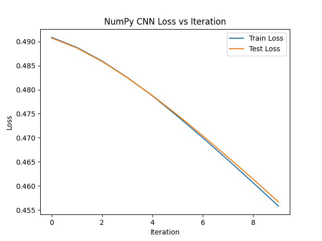

# 🧠 Deep Learning: CNN from Scratch + PyTorch UNet

A two-part deep learning project that demonstrates both foundational knowledge and practical modeling:

1. **CNN from Scratch using NumPy** – A manual implementation of a convolutional neural network trained on a subset of the MNIST dataset (digits 0, 1, 2).
2. **UNet with PyTorch** – A semantic segmentation model trained on the Oxford-IIIT Pet Dataset for multi-class image segmentation.

> 💡 This project walks through both low-level implementation and high-level deep learning workflows in a single script, showcasing the full modeling pipeline.

---

## ⚙️ Tech Stack

| Component                  | Library / Tool           |
|----------------------------|---------------------------|
| CNN Implementation         | NumPy                     |
| Segmentation Model         | PyTorch (UNet)            |
| Data Loading               | TensorFlow (MNIST), torchvision (Pets) |
| Data Visualization         | Matplotlib                |
| Model Optimization         | Gradient Descent, Adam    |
| Evaluation                 | Loss plots, prediction grids |

---

## 📁 Project Structure

```bash
cnn-unet-project/
├── main.py             # All code: NumPy CNN + PyTorch UNet
├── requirements.txt    # Dependencies to install
├── README.md           # Project overview and instructions
```
## 🚀 Getting Started
```bash
# 1. Clone the repository
git clone https://github.com/yourusername/cnn-unet-project.git
cd cnn-unet-project

#2. Install dependencies
pip install -r requirements.txt #You’ll need Python 3.8+. PyTorch with GPU support is recommended (but not required for testing).

#3. Run the project
python main.py
```
    This will:
    - Train a custom CNN on digits 0, 1, and 2 from the MNIST dataset using NumPy
    - Plot the training and test loss curves
    - Train a PyTorch UNet on the Oxford-IIIT Pet Dataset
    - Display a grid of predictions vs ground truth masks
    - Save a trained UNet model checkpoint

---

## 🔍 Key Highlights

### 🧮 CNN from Scratch (NumPy)
- Implemented using only NumPy
- Manual convolution, ReLU, flatten, fully connected layers, and backpropagation
- Trained on filtered MNIST dataset (classes 0, 1, 2)
- Loss tracked and plotted during training

### 🎯 PyTorch UNet
- Encoder–decoder structure with skip connections
- Handles 3-class segmentation for pet images
- Uses CrossEntropyLoss and Adam optimizer
- Visual output comparison: Original Image vs True Mask vs Predicted Mask
- Model checkpoint saved at end of training

## 📊 Example Outputs

**CNN Loss Plot**



**UNet Prediction Grid**

---

## 🧰 Requirements

- numpy  
- matplotlib  
- scipy  
- torch  
- torchvision  
- tensorflow  

## 📚 Datasets Used

- MNIST (via TensorFlow)
- Oxford-IIIT Pet Dataset (via torchvision)

---

## 💡 Learning Outcomes

- Hands-on understanding of CNN architecture and training mechanics
- Ability to build and debug from scratch using NumPy
- Practical modeling using PyTorch with standard datasets
- Visualization of model performance

---

## 👥 Contributors

- **Julisa Delfin** – MS Data Science, DePaul University
[](https://www.linkedin.com/in/julisadelfin/) 
